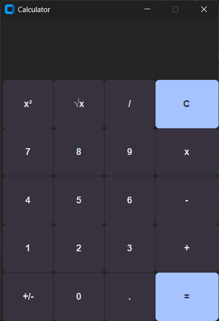

# Calculator

A simple calculator built with Python and CustomTkinter.

## Features

- Addition
- Subtraction
- Multiplication
- Division
- Square
- Square Root
- Plus / Minus
- Keyboard Support (Numpad)

## Installation

Install CustomTkinter:

```bash
pip install customtkinter
```

## Run

```bash
python Calculator.py
```

## Screenshot


